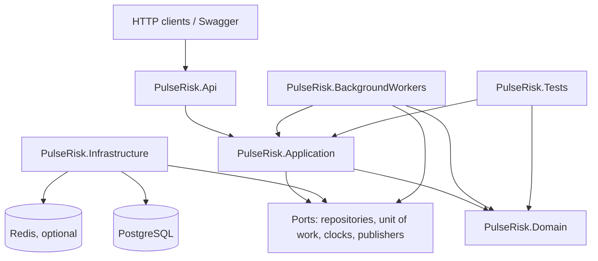
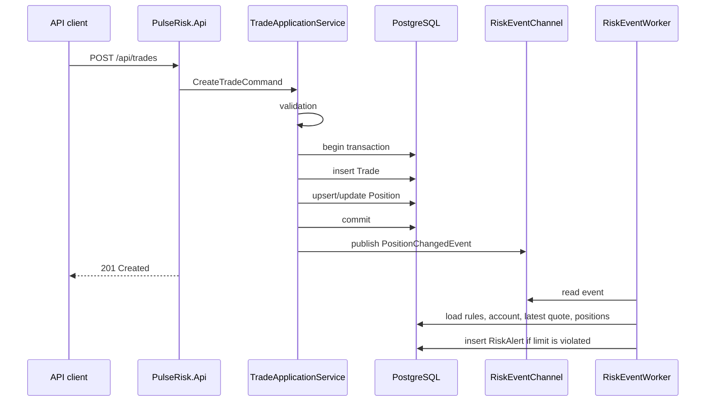
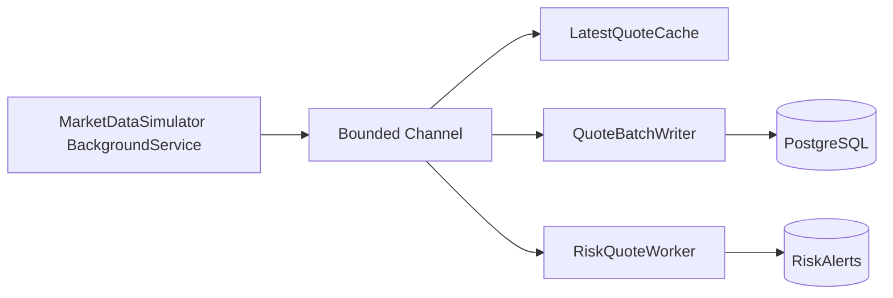
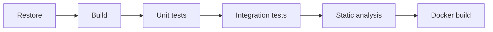

# PulseRisk: архитектура учебно-демонстрационного backend-проекта

## 1. Контекст и цель

**PulseRisk** - учебно-демонстрационный проект на .NET 10, спроектированный как демонстрация инженерных компетенций для real-time fintech/risk-management backend.

Проект имитирует backend-ядро fintech-сервиса риск-менеджмента для внебиржевого финансового рынка: система принимает поток рыночных котировок и сделки клиентов, пересчитывает позиции, оценивает риск-показатели в near real-time режиме и создает алерты при нарушении лимитов.

Главная цель проекта - показать не набор CRUD-endpoints, а инженерный backend:

- уверенное владение C#/.NET, ASP.NET Core и асинхронной моделью выполнения;
- обработку высокочастотных потоков данных;
- понимание конкурентности, backpressure и graceful shutdown;
- PostgreSQL как рабочую базу с индексами, транзакциями и оптимизированными запросами;
- применение GoF/GRASP-паттернов по назначению, без overengineering;
- тестируемую доменную логику;
- готовность проекта к обсуждению на техническом интервью по backend-разработке.

Проект не предназначен для реальной торговли, подключения к биржам или обработки реальных клиентских средств.

## 2. Архитектурный стиль

PulseRisk проектируется как **модульный монолит с внутренней событийной обработкой**.

Такой выбор лучше подходит учебно-демонстрационному проекту, чем набор микросервисов:

- вся бизнес-логика видна в одном репозитории и удобна для интервью;
- транзакционные границы сделки и позиции проще показать корректно;
- не требуется поднимать брокер сообщений, service discovery и сетевую инфраструктуру ради демонстрации;
- модули уже разделены так, чтобы в будущем вынести Market Data, Trade Processing или Risk Engine в отдельные сервисы.

Внутри монолита используется layered architecture с направлением зависимостей к домену:



Слои:

- **Api** - ASP.NET Core Web API, controllers/minimal endpoints, DTO, Swagger, middleware, validation entry points.
- **Application** - use cases, orchestration, application services, transactions, interfaces для инфраструктуры.
- **Domain** - entities, value objects, enums, domain services, pure risk-rule logic.
- **Infrastructure** - EF Core, PostgreSQL mappings, migrations, repositories, query objects, optional Redis cache, Serilog sinks.
- **BackgroundWorkers** - `BackgroundService`-обработчики котировок, risk events, batch insert и load-test сценариев.
- **Tests** - unit, integration, benchmark и testcontainers-based проверки.

## 3. Структура solution

Рекомендуемая структура репозитория:

```text
PulseRisk.slnx
src/
  PulseRisk.Api/
  PulseRisk.Application/
  PulseRisk.Domain/
  PulseRisk.Infrastructure/
  PulseRisk.BackgroundWorkers/
tests/
  PulseRisk.UnitTests/
  PulseRisk.IntegrationTests/
  PulseRisk.Benchmarks/
docs/
  explain-analyze/
  load-tests/
docker/
  postgres/
.gitlab-ci.yml
docker-compose.yml
README.md
ARCHITECTURE.md
DEVELOPMENT_PLAN.md
```

`PulseRisk.BackgroundWorkers` можно подключить как отдельный class library, а hosted services регистрировать из `PulseRisk.Api`. Для демонстрации в Docker Compose достаточно одного backend-процесса. Если потребуется показать масштабирование, workers можно вынести в отдельный worker host без изменения домена.

## 4. Доменная модель

Ключевые агрегаты и сущности:

- **Client** - клиент системы.
- **TradingAccount** - торговый счет клиента, баланс, валюта, плечо.
- **Instrument** - торговый инструмент, точность, контрактный размер, активность.
- **Trade** - сделка Buy/Sell.
- **Position** - агрегированная позиция по клиенту, счету и инструменту.
- **Quote** - рыночная котировка bid/ask.
- **RiskRule** - настраиваемое риск-правило.
- **RiskAlert** - алерт, созданный Risk Engine.

Value objects:

- `Money`;
- `Volume`;
- `Price`;
- `Symbol`;
- `Percentage`;
- `RiskThreshold`.

Value objects нужны не для украшения модели, а чтобы:

- централизовать инварианты: цена не отрицательная, объем больше нуля, символ не пустой;
- уменьшить дублирование validation logic;
- сделать unit-тесты бизнес-логики выразительными.

Для горячих потоковых событий допустимы легковесные immutable-модели:

- `QuoteTick`;
- `TradeAcceptedEvent`;
- `PositionChangedEvent`;
- `RiskEvaluationRequested`;
- `RiskAlertRaisedEvent`.

Их можно реализовать как `readonly record struct` или обычные immutable-типы после замеров. Решение принимается по benchmark-результатам, а не заранее ради "оптимизации ради оптимизации".

## 5. Основные сценарии

### 5.1. Создание сделки



Граница консистентности: сделка и позиция обновляются в одной транзакции. Risk Engine может обработать событие асинхронно после commit. Это дает быстрый API-response и сохраняет корректность критичных данных.

### 5.2. Поток котировок



Котировки идут через bounded channel. Это позволяет явно показать backpressure при нагрузке 1000-5000 ticks/sec.

Стратегия перегрузки выбирается конфигурацией:

- `Wait` - производитель ждет, когда освободится место;
- `DropOldest` - устаревшие котировки выбрасываются, если важна свежесть;
- `DropWrite` - новые котировки пропускаются, если важна стабильность потребителей;
- `SampleLatest` - Risk Engine берет последнюю котировку на инструмент с ограничением частоты пересчета.

Для демо рекомендуется режим `DropOldest` или `SampleLatest`: в риск-мониторинге чаще важна актуальная цена, а не обработка каждой исторической котировки.

## 6. Application layer

Application layer содержит use cases и orchestration, но не хранит SQL-детали.

Примеры сервисов:

- `CreateClientHandler`;
- `CreateTradingAccountHandler`;
- `CreateTradeHandler`;
- `GetClientRiskMetricsQueryHandler`;
- `CreateRiskRuleHandler`;
- `StartMarketSimulatorHandler`;
- `RunLoadScenarioHandler`.

Команды и запросы можно реализовать без внешнего mediator-пакета, чтобы не усложнять проект. Если в кодовой базе появится много cross-cutting поведения, допустимо добавить MediatR или собственный легкий dispatcher.

Рекомендуемый подход:

- commands/use cases для записи;
- query objects для сложного чтения;
- domain services для чистой бизнес-логики;
- repositories только там, где они скрывают агрегатную загрузку и сохранение;
- Dapper для тяжелых read-only запросов, если EF Core начинает генерировать неудачный SQL.

## 7. Infrastructure и PostgreSQL

### 7.1. ORM и SQL

Базовый выбор:

- **EF Core** - migrations, mappings, transactions, unit of work, CRUD и агрегатные операции.
- **Dapper** - точечные оптимизированные запросы для аналитического чтения, последних котировок, истории сделок и алертов.

Это демонстрирует прагматичный подход: EF Core используется там, где он экономит время и повышает сопровождаемость, а ручной SQL - там, где важны план запроса и контроль производительности.

### 7.2. Транзакции

Критичная транзакция:

1. Проверить существование клиента, счета и инструмента.
2. Сохранить `Trade`.
3. Обновить или создать `Position`.
4. Зафиксировать commit.
5. После commit отправить событие в risk channel.

Если будет реализован outbox pattern, пункт 5 заменяется записью outbox-события в той же транзакции и последующей публикацией worker'ом.

### 7.3. Защита от race condition

Для параллельного создания сделок по одной позиции возможны два варианта:

- optimistic concurrency через `xmin`/row version и retry policy;
- PostgreSQL advisory lock на ключ `(TradingAccountId, Symbol)` внутри транзакции.

Для учебного проекта лучше начать с optimistic concurrency:

- проще объяснить;
- хорошо демонстрирует работу с конфликтами;
- не блокирует независимые позиции.

Advisory lock можно добавить как senior-level extension и сравнить поведение под нагрузкой.

### 7.4. Индексы

Обязательные индексы:

```sql
CREATE INDEX ix_trades_client_id_created_at ON trades (client_id, created_at DESC);
CREATE INDEX ix_trades_symbol_created_at ON trades (symbol, created_at DESC);
CREATE UNIQUE INDEX ux_positions_account_symbol ON positions (trading_account_id, symbol);
CREATE INDEX ix_positions_client_id_symbol ON positions (client_id, symbol);
CREATE INDEX ix_quotes_symbol_timestamp ON quotes (symbol, timestamp DESC);
CREATE INDEX ix_risk_alerts_client_id_created_at ON risk_alerts (client_id, created_at DESC);
CREATE INDEX ix_risk_alerts_severity_created_at ON risk_alerts (severity, created_at DESC);
```

Дополнительные индексы:

- `risk_alerts(resolved_at)` для активных алертов;
- partial index `WHERE resolved_at IS NULL`;
- `risk_rules(rule_type, is_enabled)`;
- `trades(trading_account_id, created_at DESC)`.

### 7.5. Batch insert котировок

Котировки не следует вставлять по одной при highload-режиме. Нужен `QuoteBatchWriter`:

- копит batch по размеру или времени;
- пишет в PostgreSQL через bulk insert;
- логирует размер batch, задержку и ошибки;
- уважает `CancellationToken`;
- при shutdown сбрасывает остаток batch.

## 8. Risk Engine

Risk Engine - центральный модуль проекта.

Его задача - вычислять риск-метрики и применять набор risk rules.

Метрики:

- net exposure;
- floating PnL;
- margin used;
- equity;
- margin level;
- trade frequency;
- price movement percentage.

Правила:

- `MaxExposureRule`;
- `MaxLossRule`;
- `MarginLevelWarningRule`;
- `PriceSpikeDetectionRule`;
- `HighFrequencyTradingActivityRule`.

### Strategy pattern

Каждое риск-правило реализует общий контракт:

```csharp
public interface IRiskRuleStrategy
{
    RiskRuleType RuleType { get; }
    ValueTask<RiskRuleEvaluationResult> EvaluateAsync(
        RiskEvaluationContext context,
        RiskRule rule,
        CancellationToken cancellationToken);
}
```

Обоснование:

- правила независимо тестируются unit-тестами;
- новые правила добавляются без изменения большого `switch`;
- конфигурация `RiskRule` хранится в БД, а поведение выбирается через strategy resolver;
- паттерн применен в точке реальной вариативности, а не ради демонстрации GoF.

### Factory pattern

`RiskAlertFactory` создает доменные алерты из результата проверки.

Обоснование:

- формат сообщения, severity, alert type и deduplication key задаются в одном месте;
- Risk Engine не размазывает правила создания алертов по разным обработчикам.

### Deduplication

Чтобы не создавать одинаковый alert на каждый tick, нужен один из механизмов:

- `deduplication_key` и unique partial index для активных алертов;
- cooldown-window на уровне rule;
- обновление существующего активного alert вместо вставки нового.

Для первой версии рекомендуется cooldown-window и поиск активного alert по `(client_id, account_id, symbol, alert_type, resolved_at IS NULL)`.

## 9. Concurrency и background processing

Обязательные элементы:

- `BackgroundService`;
- `Channel<T>`;
- bounded channel capacity;
- `CancellationToken`;
- async I/O;
- отсутствие `.Result`, `.Wait()` и `Thread.Sleep`;
- graceful shutdown;
- structured logging по важным событиям.

Фоновые процессы:

- `MarketDataSimulatorWorker` - генерирует котировки.
- `QuoteDispatchWorker` - отправляет quote events в cache, batch writer и risk queue.
- `QuoteBatchWriterWorker` - пишет котировки в PostgreSQL batch'ами.
- `RiskEventWorker` - обрабатывает события сделок и позиций.
- `LoadTestWorker` - генерирует сделки и котировки для демонстрационного сценария.
- `OutboxPublisherWorker` - optional senior extension.

`Channel<T>` выбран вместо прямых вызовов сервисов, потому что:

- отделяет скорость producer'ов от скорости consumer'ов;
- позволяет явно показать backpressure;
- хорошо подходит для in-process event pipeline;
- проще RabbitMQ/Kafka для учебного монолита;
- поддерживает graceful completion и cancellation.

Текущая реализация начинается с `IEventWriter<TEvent>`/`IEventReader<TEvent>` и `InMemoryEventChannel<TEvent>`. Каналы настраиваются через `EventChannelOptions`: для risk events используется режим `Wait`, потому что событие изменения позиции нельзя терять, а для будущего потока котировок выбран `DropOldest`, где важнее свежие данные. Каналы отдают `EventChannelSnapshot` с depth, written/read/dropped counters и завершаются через `IEventChannelLifetime` при shutdown. `PositionChangedEventWorker` уже потребляет `PositionChangedEvent` и публикует `RiskEvaluationRequested`, но сам Risk Engine пока остается следующим модулем.

## 10. API

REST API должен быть тонким слоем над application use cases.

Группы endpoints:

- `/api/clients`;
- `/api/accounts`;
- `/api/instruments`;
- `/api/trades`;
- `/api/positions`;
- `/api/risk`;
- `/api/simulator`.

Swagger/OpenAPI обязателен. Валидацию входных DTO можно делать через FluentValidation, а доменные инварианты оставлять в value objects/entities.

Ошибки возвращаются через `ProblemDetails`:

- `400` - validation error;
- `404` - entity not found;
- `409` - concurrency conflict или duplicate active alert;
- `500` - unexpected error.

## 11. Logging, monitoring и diagnostics

Логи должны быть структурированными:

- запуск и остановка приложения;
- запуск/остановка симулятора;
- переполнение channel;
- длительные SQL-запросы;
- conflict retry при обновлении позиции;
- создание risk alert;
- batch insert статистика;
- необработанные исключения.

Рекомендуемый стек:

- Serilog JSON console sink;
- ASP.NET Core request logging;
- OpenTelemetry/Prometheus optional;
- Grafana optional.

Ключевые метрики:

- quotes generated/sec;
- quotes processed/sec;
- trades processed/sec;
- risk evaluations/sec;
- channel depth;
- dropped quotes count;
- average risk evaluation duration;
- PostgreSQL query duration;
- active alerts count.

## 12. Performance-подход

Проект должен демонстрировать не только "быстрый код", но и процесс оптимизации:

1. Сначала корректная доменная модель и тесты.
2. Затем нагрузочный сценарий.
3. Затем измерение bottleneck'ов.
4. Затем точечные оптимизации.
5. После этого benchmark/report.

Потенциальные bottleneck:

- insert котировок по одной записи;
- пересчет всех позиций клиента на каждый tick;
- N+1 запросы при расчете risk metrics;
- создание лишних объектов в quote pipeline;
- блокировки при обновлении одной позиции из параллельных сделок;
- дублирование alert'ов при частых событиях.

Оптимизации:

- batch insert quotes;
- latest quote cache;
- индексированные read models;
- bounded channels;
- sampling для quote-driven risk evaluation;
- projection-запросы вместо загрузки полных EF entities;
- `AsNoTracking` для read-only queries;
- compiled queries в горячих местах после измерений;
- BenchmarkDotNet для PnL calculator variants.

## 13. Testing strategy

Unit-тесты:

- расчет средней цены позиции;
- расчет floating PnL;
- Buy/Sell сценарии;
- Max Exposure Limit;
- Max Loss Limit;
- Margin Level Warning;
- Price Spike Detection;
- High Frequency Trading Activity;
- отключенное risk rule;
- некорректная сделка;
- deduplication active alerts.

Integration-тесты:

- создание клиента и счета;
- создание сделки и обновление позиции;
- создание risk alert при превышении лимита;
- фильтрация истории сделок;
- PostgreSQL migrations;
- optimistic concurrency/retry;
- batch insert quotes.

Интеграционные тесты запускаются через Testcontainers PostgreSQL. Бизнес-логика должна тестироваться без БД.

Первый сквозной PostgreSQL-сценарий проверяет путь `client -> account -> trade -> position`: test host подменяет только `ConnectionStrings:PulseRisk`, применяет EF Core migrations к временной базе, выполняет HTTP-запросы через `HttpClient` и затем проверяет фактическое состояние `trades`/`positions` через `PulseRiskDbContext`. На локальной машине тест помечается как skipped, если Docker Engine недоступен; в CI Docker должен быть обязательной частью runner-а.

Паттерны в тестовой инфраструктуре применяются точечно:

- **Adapter**: `WebApplicationFactory` адаптирует ASP.NET Core приложение к тестовому `HttpClient`.
- **Template Method**: `PulseRiskPostgresApplicationFactory.ConfigureWebHost` меняет только часть lifecycle test host-а.
- **Protected Variations**: тест зависит от публичного HTTP API и persistence boundary, а не от внутренней реализации handler/repository.
- **Indirection**: in-memory configuration отделяет тестовый connection string от production configuration.

## 14. CI/CD

GitLab pipeline:



Минимальные стадии:

- restore;
- build;
- unit tests;
- integration tests;
- docker build.

Артефакты:

- test results в JUnit/TRX формате;
- coverage report;
- benchmark/load-test reports optional;
- Docker image.

## 15. Docker Compose

Команда запуска:

```bash
docker compose up --build
```

Сервисы:

- `pulserisk-api`;
- `postgres`;
- `redis` optional;
- `prometheus` optional;
- `grafana` optional.

Swagger:

```text
http://localhost:5000/swagger
```

## 16. Архитектурные решения и обоснования

| Решение | Почему выбрано |
| --- | --- |
| Модульный монолит | Достаточен для учебного проекта, проще показать транзакции и домен, можно эволюционировать к сервисам |
| Layered/Clean-style architecture | Изолирует домен от API и PostgreSQL, упрощает unit-тесты |
| Internal event pipeline через Channel<T> | Демонстрирует real-time обработку, backpressure и multithreading без внешнего брокера |
| EF Core + Dapper | Баланс скорости разработки и контроля SQL в горячих read paths |
| Strategy для risk rules | Реальная вариативность правил, простое расширение и тестирование |
| Factory для risk alerts | Централизованное создание алертов и сообщений |
| Query Object для сложного чтения | Читабельные оптимизированные SQL-запросы без раздувания repositories |
| Unit of Work через DbContext | Естественная транзакционная граница для сделки и позиции |
| Options pattern | Настраиваемые лимиты, simulator rate, channel capacity, batch size |
| Optimistic concurrency | Защита позиций от race condition с понятной retry-стратегией |
| Batch insert quotes | Ключевая оптимизация для highload-режима |
| Structured logging | Диагностика продакшен-подобного backend'а |

## 17. GoF, GRASP и границы применения паттернов

Один из ключевых демонстрируемых навыков - глубокое понимание GoF/GRASP и умение применять паттерны без overengineering. Поэтому в PulseRisk паттерн считается оправданным только если он решает одну из практических проблем:

- снижает связность между слоями;
- повышает тестируемость бизнес-логики;
- изолирует изменяемую часть системы;
- устраняет дублирование алгоритмов или правил;
- делает транзакционную или конкурентную границу явной;
- помогает объяснить решение на code review или интервью.

Если паттерн не дает одного из этих эффектов, он не вводится.

### 17.1. GRASP

| GRASP-паттерн | Где применяется | Какую проблему решает | Почему это не overengineering |
| --- | --- | --- | --- |
| **Information Expert** | `Position`, `PositionCalculator`, `PnLCalculator`, risk metric calculations | Формулы позиции, PnL и exposure не должны расползаться по controllers, EF mappings и workers | Бизнес-логика тестируется без БД и находится рядом с данными, которые нужны для расчета |
| **Creator** | Методы/фабрики создания `Trade`, `Position`, `RiskAlert` | Объекты должны создаваться в валидном состоянии, с обязательными полями и инвариантами | Создание централизовано, но без сложных иерархий factory classes |
| **Controller** | API controllers и application handlers | HTTP endpoint не должен сам выполнять бизнес-сценарий | Controllers остаются тонкими, а orchestration находится в Application layer |
| **Low Coupling** | Направление зависимостей `Api -> Application -> Domain`, Infrastructure реализует порты | Домен нельзя связывать с PostgreSQL, ASP.NET Core или hosted services | Это позволяет тестировать домен отдельно и заменить инфраструктурную реализацию |
| **High Cohesion** | Отдельные модули для trade processing, positions, risk, simulator, persistence | Один "большой сервис" быстро стал бы точкой изменения для всего проекта | Каждый модуль имеет понятную ответственность и причину изменения |
| **Polymorphism** | `IRiskRuleStrategy` и реализации риск-правил | Новые risk rules не должны добавлять ветки в большой `switch` | Вариативность правил задана предметной областью, а не придумана ради паттерна |
| **Pure Fabrication** | Application handlers, repositories, query objects, calculators | Не все обязанности естественно принадлежат доменным сущностям | Эти классы уменьшают связность и делают код тестируемым |
| **Indirection** | `IEventWriter<T>`, `IEventReader<T>`, repositories, query objects | Producer котировок не должен зависеть от конкретного consumer, Application не должен знать SQL details | Посредники изолируют скорость обработки и инфраструктурные детали |
| **Protected Variations** | Ports, strategies, options, channel full-mode policies | Изменяемые места системы не должны ломать стабильный код | Абстракции ставятся только на границах ожидаемой изменчивости |

### 17.2. GoF

| GoF-паттерн | Где применяется | Какую проблему решает | Ограничение применения |
| --- | --- | --- | --- |
| **Strategy** | Risk rules: `MaxExposure`, `MaxLoss`, `MarginLevel`, `PriceSpike`, `HighFrequencyActivity` | Разные алгоритмы проверки лимитов должны расширяться и тестироваться независимо | Это основной GoF-паттерн проекта; он используется только для реальной алгоритмической вариативности |
| **Factory Method / Simple Factory** | `RiskAlertFactory`, future event factories | Создание alert/event должно быть единообразным, валидным и не размазанным по Risk Engine | Если нет полиморфной фабричной иерархии, реализация честно называется Simple Factory, а не GoF Factory Method |
| **Template Method** | `BackgroundService.ExecuteAsync` в workers | Фреймворк задает жизненный цикл worker'а, проект реализует конкретный алгоритм обработки | Это framework-level применение; собственные template base classes не вводятся без повторения |
| **Adapter** | Infrastructure implementations для application ports, PostgreSQL/Dapper adapters | Application работает с контрактами, а внешняя технология подключается снаружи | Adapter появляется только на инфраструктурной границе |
| **Command** | `CreateTradeCommand`, `CreateClientCommand` и handlers | Use case получает явный входной объект и отдельную orchestration-точку | Не реализуются undo/redo, command queue и сложный dispatcher, пока они не нужны |
| **Decorator** | Потенциальный logging/retry/validation pipeline вокруг handlers | Cross-cutting behavior не должен копироваться в каждый handler | Вводится только после появления повторяющегося поведения |

### 17.3. Enterprise patterns

Не все важные backend-подходы являются GoF. В PulseRisk отдельно применяются enterprise/application patterns:

| Паттерн | Где применяется | Зачем нужен |
| --- | --- | --- |
| **Repository** | Сохранение и загрузка агрегатов | Скрыть persistence details от Application layer |
| **Query Object** | История сделок, активные алерты, последние котировки, risk metrics | Держать оптимизированный SQL рядом с конкретным read scenario |
| **Unit of Work** | `DbContext` как транзакционная граница trade + position | Гарантировать атомарность критической операции |
| **Options pattern** | Simulator rate, channel capacity, batch size, risk thresholds | Настраивать поведение без изменения кода |
| **Producer-Consumer** | `Channel<T>` pipeline котировок и risk events | Развязать скорость генерации и обработки событий |
| **Outbox** | Optional senior extension | Надежно публиковать события после commit |

### 17.4. Анти-overengineering правила

В проекте намеренно не вводятся:

- **Abstract Factory**, пока нет семейства взаимозаменяемых продуктов;
- **Visitor**, потому что risk rules проще выразить стратегиями;
- **State**, пока жизненный цикл сделок и алертов прост;
- **Chain of Responsibility** для risk rules, потому что правила должны оцениваться независимо, а не останавливаться цепочкой;
- внешний **Mediator**, пока прямые handlers и DI достаточно понятны;
- микросервисные паттерны, пока модульный монолит лучше показывает транзакции и домен.

Каждое новое применение паттерна должно быть отражено в книге в формате: место применения, решаемая проблема, альтернатива, причина отказа от более простого решения и способ проверки.

## 18. Что проект покажет на интервью

PulseRisk должен позволить уверенно обсудить:

- почему выбран модульный монолит, а не микросервисы;
- где проходят транзакционные границы;
- как обработать 1000+ котировок в секунду без блокировки API;
- как устроен backpressure;
- как избежать race condition при параллельных сделках;
- почему risk rules реализованы через Strategy;
- где EF Core уместен, а где лучше ручной SQL;
- какие индексы нужны и почему;
- как проверить план запроса через `EXPLAIN ANALYZE`;
- как unit-тестировать бизнес-логику без БД;
- как расширить проект до распределенной системы.

## 19. Возможная эволюция

После базовой версии можно добавить senior-level возможности:

- SignalR streaming risk metrics;
- outbox pattern;
- PostgreSQL advisory locks;
- Prometheus metrics и Grafana dashboard;
- Redis latest quote cache;
- CQRS read model для риск-метрик;
- BenchmarkDotNet report;
- нагрузочный отчет;
- отдельный worker host;
- подготовленный раздел "legacy refactoring and allocation optimization" в README.
