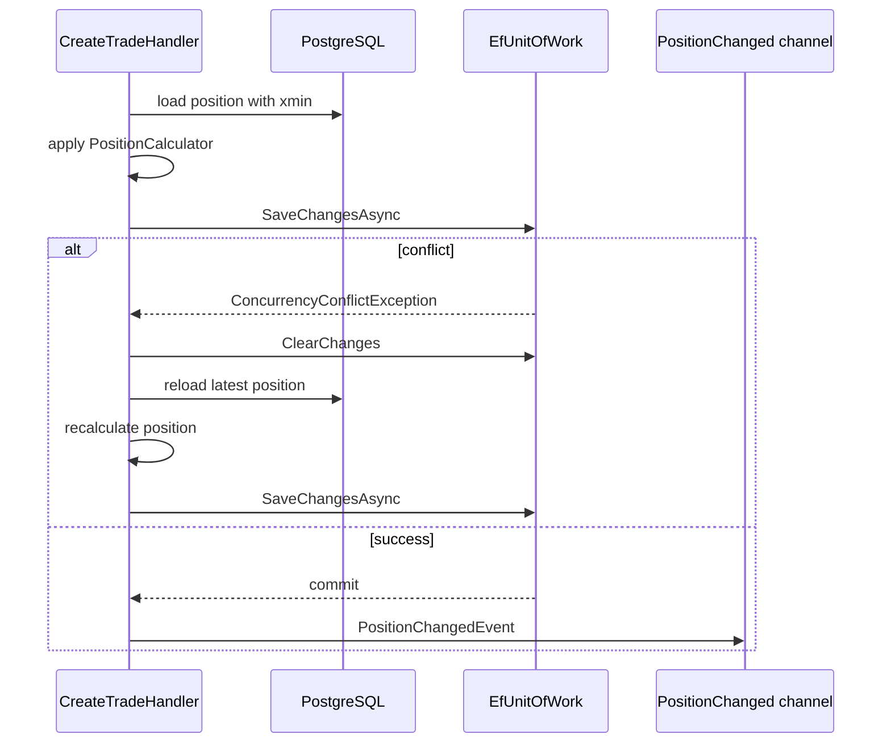

# Глава 15. Укрепляем обновление позиции

## Цель главы

Сделать trade processing устойчивее к конкурентным обновлениям одной позиции и подготовить границу для будущего Risk Engine.

После главы 14 сделка и позиция уже сохранялись одним commit. В этой главе мы добавили три вещи, которые нужны backend под нагрузкой:

- optimistic concurrency через PostgreSQL `xmin`;
- retry при конфликте обновления позиции;
- публикацию `PositionChangedEvent` после успешного commit.

## Что сделано в коде

Application layer:

- `ConcurrencyConflictException`;
- расширенный `IUnitOfWork.ClearChanges()`;
- `IEventWriter<TEvent>`;
- `IEventReader<TEvent>`;
- `PositionChangedEvent`;
- retry-loop в `CreateTradeHandler`;
- structured logs для validation failure, trade accepted, position updated и concurrency retry.

Infrastructure layer:

- `PositionConfiguration` мапит shadow property `xmin` как row version;
- `EfUnitOfWork` переводит `DbUpdateConcurrencyException` в application-level `ConcurrencyConflictException`;
- `EfUnitOfWork.ClearChanges()` очищает EF change tracker после неудачной попытки;
- `InMemoryEventChannel<TEvent>` реализует bounded channel;
- DI регистрирует writer/reader для `PositionChangedEvent`;
- migration snapshot обновлен через `AddPositionXminConcurrency`.

Tests:

- handler-тест проверяет retry после concurrency conflict;
- handler-тест проверяет публикацию `PositionChangedEvent`;
- model-level integration test проверяет `xmin` concurrency token.

## Почему нужен `xmin`

Позиция определяется парой `(TradingAccountId, Symbol)`. Если два запроса одновременно создают сделки по одной позиции, оба могут прочитать одну и ту же версию строки. Без concurrency token последний commit мог бы перезаписать результат первого.

PostgreSQL системно хранит `xmin` для каждой строки. EF Core использует его как row version:

```csharp
builder.Property<uint>("xmin")
    .IsRowVersion();
```

Когда строка меняется, `xmin` меняется тоже. Если EF пытается обновить позицию по старой версии, provider выбрасывает `DbUpdateConcurrencyException`.

## Retry flow



Retry ограничен тремя попытками. Если конфликт повторяется, API получает `409 Conflict`. Это лучше, чем бесконечная retry-петля под горячей нагрузкой.

## Паттерны GoF/GRASP

- **Protected Variations**: application code зависит от `ConcurrencyConflictException`, а не от EF `DbUpdateConcurrencyException`. Если позже будет advisory lock или raw SQL, контракт use case останется прежним.
- **Unit of Work**: `EfUnitOfWork` фиксирует commit и очищает tracked changes после неуспешной попытки. Это явная граница транзакционного состояния.
- **Producer-Consumer**: `PositionChangedEvent` пишется в bounded channel. Trade Processing не вызывает Risk Engine напрямую и не зависит от скорости будущего consumer.
- **Indirection**: `IEventWriter<PositionChangedEvent>` отделяет publisher от конкретного channel implementation.
- **Adapter**: `InMemoryEventChannel<TEvent>` адаптирует `System.Threading.Channels` к application ports.
- **GRASP Controller/Pure Fabrication**: `CreateTradeHandler` остается orchestration object: он координирует validation, retry, commit, logging и event publishing, но не хранит формулы позиции внутри себя.

Это не overengineering: retry и event writer введены в точках реальной изменчивости. Мы по-прежнему не добавляем внешний брокер, outbox и отдельный worker host, пока Risk Engine не начал потреблять события.

## Важное ограничение

Текущий retry защищает обновление уже существующей позиции. Конкурентное создание самой первой позиции по `(TradingAccountId, Symbol)` может упереться в unique index и потребует отдельной обработки `DbUpdateException` или предварительного lock/upsert. Это хороший кандидат для следующего hardening-шага вместе с Testcontainers PostgreSQL.

## Проверка результата

Команды:

```bash
dotnet build PulseRisk.slnx
dotnet test PulseRisk.slnx --no-build
dotnet ef migrations script 20260701150235_InitialCreate 20260701163801_AddPositionXminConcurrency --project src/PulseRisk.Infrastructure --startup-project src/PulseRisk.Api
```

Результат текущей итерации:

- unit-тесты: `31/31`;
- integration tests: `5/5`;
- SQL migration script для `xmin` не содержит `ALTER TABLE ADD COLUMN`, потому что `xmin` является системной колонкой PostgreSQL.

## Чек-лист главы

- [x] `Position` настроена на optimistic concurrency через `xmin`.
- [x] EF concurrency exception переводится в application exception.
- [x] `CreateTradeHandler` делает retry при конфликте.
- [x] После конфликта EF change tracker очищается.
- [x] После commit публикуется `PositionChangedEvent`.
- [x] Event writer реализован через bounded channel.
- [x] Structured logs добавлены.
- [x] Unit/model tests обновлены.
