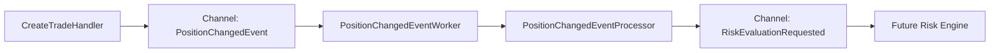

# Глава 18. Проектируем internal event pipeline

## Цель главы

Подготовить PulseRisk к real-time обработке: отделить producers от consumers, описать события системы и добавить первый фоновый consumer для risk-потока.

После главы 15 `CreateTradeHandler` уже публиковал `PositionChangedEvent`. В этой главе событие перестало быть тупиком: его читает worker и превращает в `RiskEvaluationRequested`, который в следующих главах заберет Risk Engine.

## Что сделано в коде

Application layer:

- `QuoteTick`;
- `TradeAcceptedEvent`;
- `PositionChangedEvent`;
- `RiskEvaluationRequested`;
- `RiskAlertRaisedEvent`;
- `IEventWriter<TEvent>`;
- `IEventReader<TEvent>`;
- `EventChannelOptions`;
- `EventChannelFullMode`;
- `EventChannelSettings`.

Infrastructure layer:

- `InMemoryEventChannel<TEvent>` стал configurable bounded channel;
- channel capacity и full mode читаются из `EventChannels`;
- DI регистрирует каналы для quote/risk events.

BackgroundWorkers layer:

- `PositionChangedEventWorker`;
- `PositionChangedEventProcessor`;
- регистрация hosted service.

Tests:

- `PositionChangedEventProcessorTests` проверяет, что изменение позиции создает `RiskEvaluationRequested`.

## Event flow



## Почему это не прямой вызов Risk Engine

Trade Processing не должен знать, кто и с какой скоростью будет считать риск. Если вызвать Risk Engine напрямую из `CreateTradeHandler`, HTTP request начнет зависеть от тяжелого расчета, загрузки правил, котировок и сохранения алертов.

Event pipeline решает другую задачу:

- сделка быстро фиксируется в PostgreSQL;
- после commit публикуется событие;
- consumer читает событие в своем темпе;
- будущий Risk Engine можно менять без изменения trade use case.

## Паттерны GoF/GRASP

- **Producer-Consumer**: `CreateTradeHandler` производит `PositionChangedEvent`, worker потребляет его асинхронно.
- **Indirection**: `IEventWriter<T>` и `IEventReader<T>` скрывают `Channel<T>` от Application layer.
- **Adapter**: `InMemoryEventChannel<TEvent>` адаптирует `System.Threading.Channels` к application ports.
- **Template Method**: `PositionChangedEventWorker` наследует `BackgroundService`; фреймворк управляет жизненным циклом, а проект реализует `ExecuteAsync`.
- **GRASP Protected Variations**: если позже появится outbox, Redis Stream, RabbitMQ или Kafka, основная application-логика останется на контракте writer/reader.
- **GRASP Pure Fabrication**: `PositionChangedEventProcessor` выделен для тестируемой обработки одного сообщения без запуска hosted service.

Это не overengineering: абстракции стоят на границе скорости и жизненного цикла. Producer, channel, worker и будущий Risk Engine меняются по разным причинам.

## Настройка каналов

В `appsettings.json` появился раздел:

```json
{
  "EventChannels": {
    "DefaultCapacity": 1024,
    "DefaultFullMode": "Wait",
    "QuoteCapacity": 4096,
    "QuoteFullMode": "DropOldest",
    "RiskCapacity": 1024,
    "RiskFullMode": "Wait"
  }
}
```

Для risk events выбран `Wait`: потерять событие изменения позиции хуже, чем притормозить producer. Для quote events по умолчанию выбран `DropOldest`: в потоке котировок часто важнее свежая цена, чем обработка каждой устаревшей.

## Что пока сознательно не сделано

- счетчик dropped events;
- логирование channel pressure;
- graceful completion API для manual shutdown канала;
- отдельный outbox pattern;
- настоящий Risk Engine consumer.

Эти задачи остаются для следующих глав. В этой главе цель была не написать весь event-driven backend сразу, а сделать надежную и объяснимую внутреннюю событийную границу.

## Проверка результата

Команды:

```bash
dotnet build PulseRisk.slnx
dotnet test PulseRisk.slnx --no-build
```

Результат текущей итерации:

- unit-тесты: `35/35`;
- integration tests: `5/5`.

## Чек-лист главы

- [x] Все базовые event contracts добавлены.
- [x] `IEventWriter<T>` и `IEventReader<T>` используются как application ports.
- [x] `InMemoryEventChannel<TEvent>` поддерживает configurable capacity.
- [x] `InMemoryEventChannel<TEvent>` поддерживает configurable full mode.
- [x] `PositionChangedEventWorker` читает position events.
- [x] `PositionChangedEventProcessor` публикует `RiskEvaluationRequested`.
- [x] Processor покрыт unit-тестом.
