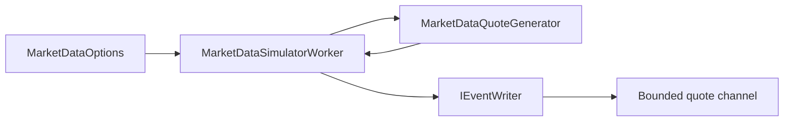

# Глава 20. Создаем Market Data Simulator

## Цель главы

Добавить первый источник рыночных событий: `MarketDataSimulatorWorker`, который генерирует `QuoteTick` для настроенных инструментов и отправляет их в bounded quote channel.

После глав 18-19 у нас уже был внутренний event pipeline с backpressure diagnostics. Но quote channel оставался без реального producer-а. В этой главе мы подключаем producer, который можно включить конфигурацией и использовать как основу для будущих batch insert, latest quote cache и quote-driven risk evaluation.

## Демонстрируемые компетенции

Глава показывает:

- работу с `BackgroundService`;
- генерацию событий через `PeriodicTimer` и `CancellationToken`;
- настройку поведения через options pattern;
- validation options на старте приложения;
- producer-consumer pipeline через `IEventWriter<QuoteTick>`;
- осознанный отказ от `Thread.Sleep`;
- тестирование генератора и options validation отдельно от hosted lifecycle.

## Что уже есть в проекте

К началу главы уже реализованы:

- `QuoteTick`;
- `IEventWriter<TEvent>`;
- bounded channel для quote events;
- `EventChannelOptions` с `QuoteCapacity` и `QuoteFullMode`;
- diagnostics counters для written/read/dropped messages;
- graceful completion каналов при shutdown.

Это значит, что симулятору не нужно знать о конкретной реализации `Channel<T>`. Он должен зависеть от application-level контракта `IEventWriter<QuoteTick>`.

## Что сделаем сейчас

Добавим:

- `MarketDataOptions`;
- `MarketDataOptionsValidator`;
- `MarketDataQuoteGenerator`;
- `MarketDataSimulatorWorker`;
- регистрацию симулятора в `AddPulseRiskBackgroundWorkers`;
- конфигурацию `MarketData` в `appsettings.json`;
- unit-тесты генератора и validation options.

## Проектное решение

Симулятор по умолчанию выключен:

```json
"MarketData": {
  "Enabled": false
}
```

Это важная инженерная мелочь. Пока нет batch writer и latest quote cache, автоматическая генерация котировок при каждом запуске API только засоряла бы channel и логи. Для демонстрации симулятор можно включить явно:

```json
"MarketData": {
  "Enabled": true,
  "Symbols": [ "EURUSD", "GBPUSD", "XAUUSD" ],
  "TicksPerSecondPerInstrument": 2
}
```

Рабочий поток:



## Паттерны GoF/GRASP

- **Producer-Consumer**: `MarketDataSimulatorWorker` выступает producer-ом, а quote channel отделяет скорость генерации от будущих consumers.
- **GRASP Controller / Pure Fabrication**: worker управляет lifecycle, таймером, логированием и записью события, но не хранит внутри себя модель цены.
- **Information Expert**: `MarketDataQuoteGenerator` отвечает за bid/ask, потому что именно он владеет состоянием последней mid-price по символу.
- **Indirection**: worker зависит от `IEventWriter<QuoteTick>`, а не от `InMemoryEventChannel<QuoteTick>`.
- **Protected Variations**: позже quote writer можно заменить на Kafka/outbox/external feed adapter, не меняя генератор цены.
- **Template Method**: `BackgroundService.ExecuteAsync` задает точку расширения для hosted worker lifecycle.
- **Strategy-like policy**: поведение переполнения quote channel остается в `EventChannelOptions.QuoteFullMode`; симулятор не принимает решение, отбрасывать ли котировки.

Это не overengineering: мы добавили ровно две новые роли. Generator нужен, чтобы тестировать модель цены без hosted service. Worker нужен, чтобы встроиться в ASP.NET Core lifecycle. Отдельный dispatcher, scheduler framework или внешний брокер пока не нужны.

## Реализация шаг за шагом

### Шаг 1. Описываем MarketDataOptions

`MarketDataOptions` содержит:

- `Enabled`;
- `Symbols`;
- `TicksPerSecondPerInstrument`;
- `PriceStepPercent`;
- `SpreadPercent`;
- `MinimumPrice`;
- `StatisticsIntervalSeconds`.

Метод `GetNormalizedSymbols()` приводит символы к upper-case, убирает пустые строки и дубликаты.

### Шаг 2. Валидируем options

`MarketDataOptionsValidator` проверяет:

- если симулятор включен, список символов не пуст;
- частота генерации от 1 до 1000 ticks/sec/instrument;
- spread и шаг цены положительные и не чрезмерные;
- минимальная цена положительная;
- интервал статистики положительный.

В DI используется `ValidateOnStart()`. Ошибка конфигурации должна обнаружиться при запуске приложения, а не спустя несколько минут в фоновом потоке.

### Шаг 3. Генерируем bid/ask

`MarketDataQuoteGenerator` хранит последнюю mid-price по каждому символу. Для известных инструментов используются стартовые цены:

- `EURUSD` - `1.10000`;
- `GBPUSD` - `1.27000`;
- `XAUUSD` - `2350.00`.

Каждый новый tick:

1. Берет предыдущую mid-price.
2. Сдвигает ее на случайный процент в пределах `PriceStepPercent`.
3. Рассчитывает half-spread через `SpreadPercent`.
4. Возвращает `QuoteTick` с `Bid <= Ask`.

Это не рыночная модель промышленного уровня. Это controlled simulator для разработки pipeline, тестов и демонстрации нагрузки.

### Шаг 4. Запускаем BackgroundService

`MarketDataSimulatorWorker`:

- выходит сразу, если `MarketData:Enabled=false`;
- создает `PeriodicTimer`;
- на каждом tick генерирует котировку для каждого символа;
- пишет событие через `IEventWriter<QuoteTick>`;
- логирует старт, остановку и `quotes/sec`;
- уважает `CancellationToken`.

Ключевой момент: здесь нет `Thread.Sleep`. Фоновый процесс не блокирует поток и корректно реагирует на остановку host-а.

### Шаг 5. Регистрируем worker

В `AddPulseRiskBackgroundWorkers` добавлены:

```csharp
services.AddOptions<MarketDataOptions>()
    .Bind(configuration.GetSection(MarketDataOptions.SectionName))
    .ValidateOnStart();

services.AddSingleton<IValidateOptions<MarketDataOptions>, MarketDataOptionsValidator>();
services.AddSingleton<MarketDataQuoteGenerator>();
services.AddHostedService<MarketDataSimulatorWorker>();
```

Так симулятор становится частью обычного host lifecycle, но его активность управляется конфигурацией.

### Шаг 6. Покрываем unit-тестами

Добавлены тесты:

- `MarketDataOptionsValidatorTests`;
- `MarketDataQuoteGeneratorTests`.

Мы не тестируем `BackgroundService` через искусственное ожидание времени. Это сделало бы suite хрупким. Вместо этого отдельно проверяем чистую часть логики: validation и генерацию корректного `QuoteTick`.

## Проверка результата

Команды:

```bash
dotnet build PulseRisk.slnx
dotnet test PulseRisk.slnx --no-build
```

Результат текущей итерации:

- unit-тесты: `41/41`;
- integration tests: `6/7`;
- skipped integration tests: `1/7`.

Пропущенный integration test по-прежнему связан с Docker/Testcontainers PostgreSQL.

## Что изменилось в репозитории

- Добавлен `MarketDataOptions`.
- Добавлен `MarketDataOptionsValidator`.
- Добавлен `MarketDataQuoteGenerator`.
- Добавлен `MarketDataSimulatorWorker`.
- `AddPulseRiskBackgroundWorkers` регистрирует market data subsystem.
- `appsettings.json` получил секцию `MarketData`.
- Добавлены unit-тесты для генератора и validation options.
- Обновлены `DEVELOPMENT_PLAN.md`, `ARCHITECTURE.md`, `README.md` и `book/progress.md`.

## Почему сделали именно так

Симулятор должен быть простым, но не примитивным. Если бы мы прямо в worker-е писали random bid/ask и `Task.Delay`, код было бы трудно тестировать и расширять. Если бы мы сразу строили сложный market model, мы бы ушли в overengineering.

Текущий вариант держит баланс:

- generator тестируется отдельно;
- worker отвечает только за lifecycle;
- quote channel отвечает за backpressure;
- options отвечают за настройку;
- batch writer остается следующим независимым шагом.

## Альтернативы

- **Генерировать котировки прямо в API endpoint**: удобно для ручного демо, но плохо показывает background processing.
- **Использовать `Thread.Sleep`**: просто, но блокирует поток и плохо реагирует на shutdown.
- **Сразу писать котировки в PostgreSQL**: пропускает важную архитектурную границу quote pipeline.
- **Сразу подключать внешний market feed**: несоразмерно учебному этапу и усложняет локальный запуск.
- **Сделать сложную stochastic model**: интересно, но не нужно для проверки backend pipeline.

## Частые ошибки

- Включить симулятор по умолчанию и случайно перегружать локальный запуск.
- Не валидировать частоту генерации и получить нулевой/отрицательный interval.
- Генерировать `Bid > Ask`.
- Завязать worker на конкретный `Channel<T>` вместо `IEventWriter<QuoteTick>`.
- Проверять hosted worker тестом, который зависит от реального времени и нестабилен на CI.

## Вопросы для интервью

- Почему симулятор выключен по умолчанию?
- Почему `MarketDataQuoteGenerator` отделен от `MarketDataSimulatorWorker`?
- Как quote channel защищает систему от producer-а, который генерирует быстрее consumer-а?
- Почему `DropOldest` может быть уместен для котировок?
- Что изменится при переходе от normal load к high load?
- Где появится batch writer и почему он не должен быть частью simulator worker?

## Чек-лист главы

- [x] `MarketDataOptions` добавлен.
- [x] Options validation добавлена.
- [x] `MarketDataQuoteGenerator` добавлен.
- [x] `MarketDataSimulatorWorker` добавлен.
- [x] Симулятор пишет в `IEventWriter<QuoteTick>`.
- [x] Частота генерации настраивается.
- [x] `Thread.Sleep` не используется.
- [x] Старт/остановка/statistics логируются.
- [x] Unit-тесты добавлены.
- [x] Код собирается.
- [x] Проверки выполнены.
