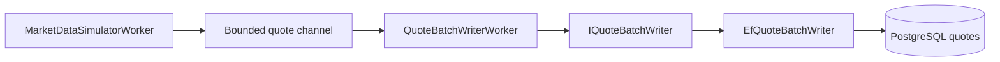

# Глава 21. Пишем batch writer для котировок

## Цель главы

Научить систему сохранять поток `QuoteTick` в PostgreSQL batch'ами: читать события из quote channel, накапливать batch по размеру или времени, писать котировки в таблицу `quotes` и сбрасывать остаток batch при shutdown.

После главы 20 у нас появился producer котировок: `MarketDataSimulatorWorker`. Но если каждую котировку сразу писать отдельным `INSERT`, высокочастотный поток быстро упрется в накладные расходы БД. Поэтому следующий шаг - отделить генерацию котировок от записи и добавить batch writer.

## Демонстрируемые компетенции

Глава показывает:

- producer-consumer pipeline для рыночных данных;
- batch insert как первую производительную оптимизацию;
- корректный lifetime scoped EF Core adapter из singleton hosted worker;
- flush по размеру batch и по таймеру;
- flush остатка при shutdown;
- сохранение слоистой архитектуры: worker не зависит от `DbContext`;
- Testcontainers-проверку записи в настоящую PostgreSQL.

## Что уже есть в проекте

К началу главы уже реализованы:

- `QuoteTick`;
- bounded quote channel;
- `MarketDataSimulatorWorker`;
- `MarketDataQuoteGenerator`;
- таблица `quotes`;
- EF Core mapping `QuoteConfiguration`;
- seed инструментов `EURUSD`, `GBPUSD`, `XAUUSD`;
- индекс `quotes(symbol, timestamp DESC)`.

Этого достаточно, чтобы построить первый persistence consumer для quote stream.

## Что сделаем сейчас

Добавим:

- `QuoteBatchOptions`;
- `QuoteBatchOptionsValidator`;
- application port `IQuoteBatchWriter`;
- infrastructure adapter `EfQuoteBatchWriter`;
- hosted worker `QuoteBatchWriterWorker`;
- регистрацию batch writer в DI;
- секцию `QuoteBatch` в `appsettings.json`;
- unit-тесты options validation;
- Testcontainers integration test batch insert.

## Проектное решение

Поток теперь выглядит так:



`QuoteBatchWriterWorker` не создает `PulseRiskDbContext` напрямую. Он создает DI scope на каждый flush и получает `IQuoteBatchWriter`. Это сохраняет корректный scoped lifetime EF Core и не связывает BackgroundWorkers с Infrastructure.

## Паттерны GoF/GRASP

- **Producer-Consumer**: market simulator производит `QuoteTick`, batch writer потребляет их с собственной скоростью.
- **GRASP Indirection**: `IQuoteBatchWriter` отделяет worker от EF Core.
- **Adapter**: `EfQuoteBatchWriter` адаптирует application port к PostgreSQL/EF Core.
- **Unit of Work**: `SaveChangesAsync` фиксирует batch одним commit.
- **Protected Variations**: позже `EfQuoteBatchWriter` можно заменить на `COPY`, Dapper bulk insert или специализированный writer без изменения worker.
- **Template Method**: `BackgroundService.ExecuteAsync` задает lifecycle hosted worker-а.
- **Pure Fabrication**: `QuoteBatchWriterWorker` не является доменной сущностью, но нужен для orchestration: чтение channel, накопление batch, timer flush, scoped persistence.

Это не overengineering: дополнительный port появляется на реальной границе изменчивости. Способ записи котировок почти наверняка будет оптимизироваться, а lifecycle worker-а не должен меняться из-за перехода с EF Core на bulk SQL.

## Реализация шаг за шагом

### Шаг 1. Добавляем QuoteBatchOptions

`QuoteBatchOptions` содержит:

- `BatchSize`;
- `FlushIntervalMilliseconds`.

Конфигурация по умолчанию:

```json
"QuoteBatch": {
  "BatchSize": 500,
  "FlushIntervalMilliseconds": 1000
}
```

`QuoteBatchOptionsValidator` защищает от ошибочной конфигурации:

- batch size от 1 до 10000;
- flush interval от 10 до 60000 ms.

### Шаг 2. Вводим application port

В Application layer добавлен контракт:

```csharp
public interface IQuoteBatchWriter
{
    Task WriteAsync(IReadOnlyCollection<QuoteTick> ticks, CancellationToken cancellationToken);
}
```

Это не repository в классическом смысле агрегата, а persistence port для конкретного write scenario. Он принимает application event model и скрывает способ записи.

### Шаг 3. Реализуем EF adapter

`EfQuoteBatchWriter`:

1. Принимает batch `QuoteTick`.
2. Мапит каждый tick в доменную entity `Quote`.
3. Проверяет инварианты через `Symbol` и `Price`.
4. Вызывает `AddRangeAsync`.
5. Делает `SaveChangesAsync`.
6. Очищает change tracker.

Очистка change tracker важна для длинноживущего потока batch inserts: даже scoped writer живет только один flush, но явная очистка показывает намерение не держать накопленные tracked entities.

### Шаг 4. Пишем QuoteBatchWriterWorker

Worker делает две вещи параллельно:

- читает `QuoteTick` из `IEventReader<QuoteTick>`;
- периодически сбрасывает накопленный batch по таймеру.

Flush происходит:

- когда batch достиг `BatchSize`;
- когда сработал `FlushIntervalMilliseconds`;
- в `finally` при остановке worker-а.

Для доступа к batch используется lock, а запись защищена `SemaphoreSlim`, чтобы два flush-триггера не писали одновременно.

### Шаг 5. Учитываем scoped lifetime

Hosted services регистрируются как singleton. `PulseRiskDbContext` является scoped. Поэтому worker не может напрямую получить EF writer через constructor injection.

Правильный путь:

```csharp
await using var scope = scopeFactory.CreateAsyncScope();
var writer = scope.ServiceProvider.GetRequiredService<IQuoteBatchWriter>();
await writer.WriteAsync(batch, cancellationToken);
```

Так каждый flush получает чистый scoped `DbContext`.

### Шаг 6. Добавляем integration test

`QuoteBatchWriterPostgreSqlTests` поднимает PostgreSQL через Testcontainers, применяет migrations, получает `IQuoteBatchWriter` из DI и пишет две котировки:

- `EURUSD`;
- `GBPUSD`.

После записи тест читает `PulseRiskDbContext.Quotes` и проверяет symbol, bid и ask.

Если Docker Engine недоступен, тест помечается как skipped, чтобы локальный test suite не становился красным из-за инфраструктуры.

## Проверка результата

Команды:

```bash
dotnet build PulseRisk.slnx
dotnet test PulseRisk.slnx
```

Результат текущей итерации:

- unit-тесты: `43/43`;
- integration tests: `6/8`;
- skipped integration tests: `2/8`.

Оба skipped tests зависят от Docker/Testcontainers PostgreSQL.

## Что изменилось в репозитории

- Добавлен `IQuoteBatchWriter`.
- Добавлен `EfQuoteBatchWriter`.
- Добавлен `QuoteBatchOptions`.
- Добавлен `QuoteBatchOptionsValidator`.
- Добавлен `QuoteBatchWriterWorker`.
- `AddPulseRiskBackgroundWorkers` регистрирует quote batch subsystem.
- `AddPulseRiskInfrastructure` регистрирует EF adapter.
- `appsettings.json` получил секцию `QuoteBatch`.
- Добавлены unit-тесты validation options.
- Добавлен PostgreSQL integration test batch insert.
- Обновлены `DEVELOPMENT_PLAN.md`, `ARCHITECTURE.md`, `README.md`, `book/progress.md`.

## Почему сделали именно так

Главная цель - не просто записать котировки, а сохранить правильные границы:

- simulator не знает PostgreSQL;
- channel не знает batch writer;
- worker не знает EF Core;
- Infrastructure знает, как мапить tick в `Quote`;
- PostgreSQL получает пачки, а не одиночные insert'ы на каждый tick.

Такой дизайн оставляет место для будущей оптимизации. Если EF Core `AddRangeAsync` станет bottleneck, мы заменим только `EfQuoteBatchWriter`, а orchestration worker останется прежним.

## Альтернативы

- **Писать каждую котировку сразу в БД**: проще, но плохо масштабируется.
- **Дать simulator-у ссылку на DbContext**: быстро, но ломает разделение responsibilities.
- **Сразу использовать PostgreSQL COPY**: быстрее, но преждевременно для первой версии без измерений.
- **Сделать batch writer частью Infrastructure**: тогда lifecycle hosted service смешался бы с persistence details.
- **Писать в один вечный DbContext**: опасно из-за tracking, lifetime и connection management.

## Частые ошибки

- Инжектить scoped `DbContext` напрямую в singleton hosted service.
- Не flush'ить остаток batch при shutdown.
- Не ограничивать batch size.
- Не валидировать flush interval.
- Считать `Channel<T>` broadcast-механизмом. Текущий quote channel имеет одного consumer-а; fan-out для cache/risk worker будет отдельным архитектурным шагом.
- Не проверять batch insert на настоящей PostgreSQL.

## Вопросы для интервью

- Почему batch writer читает из channel, а не вызывается simulator-ом напрямую?
- Почему `IQuoteBatchWriter` находится в Application layer?
- Почему worker создает scope на каждый flush?
- Когда EF Core `AddRangeAsync` станет недостаточным?
- Как бы вы реализовали bulk insert через PostgreSQL `COPY`?
- Как организовать fan-out, если котировки должны читать batch writer, latest quote cache и risk worker одновременно?

## Чек-лист главы

- [x] `QuoteBatchOptions` добавлен.
- [x] Options validation добавлена.
- [x] `IQuoteBatchWriter` добавлен.
- [x] `EfQuoteBatchWriter` добавлен.
- [x] `QuoteBatchWriterWorker` читает quote channel.
- [x] Flush по batch size реализован.
- [x] Flush по interval реализован.
- [x] Flush при shutdown реализован.
- [x] Unit-тесты options validation добавлены.
- [x] PostgreSQL integration test batch insert добавлен.
- [x] Код собирается.
- [x] Проверки выполнены.
