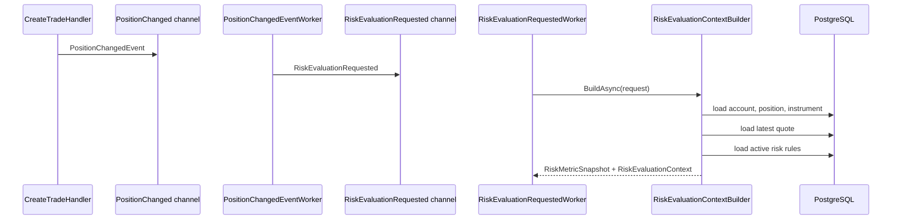

# Глава 22. Проектируем Risk Engine

## Цель главы

Добавить первый рабочий каркас Risk Engine: обработчик `RiskEvaluationRequested`, application-порты для active rules и latest quote, сборщик `RiskMetricSnapshot` и worker, который подготавливает контекст для будущих risk strategies.

Мы пока не создаем risk alerts и не реализуем сами правила. Это сознательная пауза: сначала нужно стабилизировать входные данные Risk Engine и формулы метрик, а уже затем подключать полиморфные стратегии правил.

## Демонстрируемые компетенции

Глава показывает:

- event-driven обработку risk requests;
- scoped application pipeline внутри singleton hosted worker;
- загрузку account/position/instrument/latest quote/active rules;
- расчет risk metrics на основании позиции и последней котировки;
- применение ports/adapters без привязки Application layer к EF Core;
- подготовку Strategy pattern без преждевременной реализации всех правил.

## Что уже есть в проекте

К началу главы уже реализованы:

- `PositionChangedEvent`;
- `RiskEvaluationRequested`;
- bounded channel для risk events;
- `PositionChangedEventWorker`;
- `PositionChangedEventProcessor`;
- `QuoteBatchWriterWorker`;
- таблицы `risk_rules`, `risk_alerts`, `quotes`;
- seed активных `RiskRule`;
- `PnLCalculator`.

После сделки система уже публикует `PositionChangedEvent`. Теперь нужно превратить это в подготовку risk evaluation.

## Что сделаем сейчас

Добавим:

- `ILatestQuoteReader`;
- `IRiskRuleRepository`;
- `RiskEvaluationPreparation`;
- `RiskEvaluationContextBuilder`;
- `EfLatestQuoteReader`;
- `EfRiskRuleRepository`;
- `RiskEvaluationProcessor`;
- `RiskEvaluationRequestedWorker`;
- unit-тесты расчета `RiskMetricSnapshot`.

## Проектное решение

Поток после сделки теперь выглядит так:



`RiskEvaluationRequestedWorker` создает DI scope на каждое событие, потому что builder зависит от repositories/readers, а они используют scoped EF Core adapters.

## Паттерны GoF/GRASP

- **Producer-Consumer**: `RiskEvaluationRequested` отделяет источник события от Risk Engine processing.
- **GRASP Controller / Pure Fabrication**: `RiskEvaluationRequestedWorker` управляет lifecycle и чтением channel, но не рассчитывает метрики.
- **Information Expert**: `RiskEvaluationContextBuilder` знает, какие данные нужны для snapshot: account, position, instrument и latest quote.
- **Indirection**: `ILatestQuoteReader` и `IRiskRuleRepository` отделяют Application layer от PostgreSQL.
- **Adapter**: `EfLatestQuoteReader` и `EfRiskRuleRepository` адаптируют EF Core к application ports.
- **Protected Variations**: latest quote source позже можно заменить на cache/Redis/read model, не меняя Risk Engine orchestration.
- **Strategy preparation**: `RiskEvaluationContext` и active rules подготавливают место для `IRiskRuleStrategy`, но сами стратегии вводятся в следующей главе.

Это не overengineering: каждый новый порт закрывает конкретную изменяемую границу. Latest quote почти наверняка переедет из PostgreSQL в cache, а active rules могут получить отдельную read model или кэширование.

## Реализация шаг за шагом

### Шаг 1. Вводим ports

`ILatestQuoteReader` возвращает последнюю котировку по символу:

```csharp
Task<Quote?> GetLatestAsync(Symbol symbol, CancellationToken cancellationToken);
```

`IRiskRuleRepository` возвращает только enabled rules:

```csharp
Task<IReadOnlyCollection<RiskRule>> ListEnabledAsync(CancellationToken cancellationToken);
```

Именно active rules должны попадать в evaluation. Disabled rule не должен участвовать в проверке.

### Шаг 2. Добавляем EF adapters

`EfLatestQuoteReader` читает `quotes` с сортировкой `Timestamp DESC`.

`EfRiskRuleRepository` читает `risk_rules`, фильтруя `IsEnabled`.

Обе реализации живут в Infrastructure. Application знает только ports.

### Шаг 3. Собираем RiskEvaluationPreparation

`RiskEvaluationContextBuilder` выполняет orchestration:

1. Нормализует symbol.
2. Загружает trading account.
3. Проверяет, что account принадлежит client.
4. Загружает position.
5. Загружает instrument.
6. Загружает latest quote.
7. Загружает active risk rules.
8. Рассчитывает `RiskMetricSnapshot`.
9. Создает `RiskEvaluationContext`.

Если latest quote или position отсутствуют, evaluation не падает, а возвращает skipped result с причиной. Это важно для near real-time pipeline: отсутствие котировки не должно ломать worker.

### Шаг 4. Рассчитываем метрики

Текущие формулы:

```text
floatingPnL = PnLCalculator(position, latestQuote, contractSize)
netExposure = abs(netVolume) * averagePrice * contractSize
marginUsed = netExposure / leverage
equity = balance + floatingPnL
marginLevel = marginUsed == 0 ? decimal.MaxValue : equity / marginUsed * 100
```

Эти формулы достаточно простые для первой версии. Они будут уточняться после появления реальных risk strategies и load reports.

### Шаг 5. Подключаем worker

`RiskEvaluationRequestedWorker` читает risk channel и создает scope на каждое сообщение:

```csharp
await using var scope = scopeFactory.CreateAsyncScope();
var processor = scope.ServiceProvider.GetRequiredService<RiskEvaluationProcessor>();
await processor.ProcessAsync(request, stoppingToken);
```

`RiskEvaluationProcessor` пока только строит context и логирует результат. Применение правил будет добавлено после реализации `IRiskRuleStrategy`.

### Шаг 6. Покрываем расчет unit-тестом

`RiskEvaluationContextBuilderTests` проверяет сценарий:

- account balance `10000`;
- leverage `100`;
- position `2 EURUSD` по `1.25`;
- latest quote bid/ask `1.30/1.31`;
- contract size `100000`.

Ожидаемые метрики:

- `NetExposure = 250000`;
- `FloatingPnL = 10000`;
- `Equity = 20000`;
- `MarginUsed = 2500`;
- `MarginLevel = 800`.

Отдельный тест проверяет, что отсутствие latest quote приводит к skipped evaluation.

## Проверка результата

Команды:

```bash
dotnet build PulseRisk.slnx
dotnet test PulseRisk.slnx
```

Результат текущей итерации:

- unit-тесты: `45/45`;
- integration tests: `6/8`;
- skipped integration tests: `2/8`.

Оба skipped tests зависят от Docker/Testcontainers PostgreSQL.

## Что изменилось в репозитории

- Добавлен `ILatestQuoteReader`.
- Добавлен `IRiskRuleRepository`.
- Добавлен `RiskEvaluationPreparation`.
- Добавлен `RiskEvaluationContextBuilder`.
- Добавлен `EfLatestQuoteReader`.
- Добавлен `EfRiskRuleRepository`.
- Добавлен `RiskEvaluationProcessor`.
- Добавлен `RiskEvaluationRequestedWorker`.
- DI registrations обновлены в Application, Infrastructure и BackgroundWorkers.
- Добавлены unit-тесты risk context builder.
- Обновлены `DEVELOPMENT_PLAN.md`, `ARCHITECTURE.md`, `README.md`, `book/progress.md`.

## Почему сделали именно так

Risk Engine легко превратить в большой сервис, который делает все сразу: читает БД, считает метрики, выбирает правила, создает alerts и пишет их назад. Мы сознательно не делаем этого.

Границы разделены:

- worker читает события;
- processor управляет одним request;
- builder собирает данные и метрики;
- repositories/readers скрывают PostgreSQL;
- будущие strategies будут отвечать только за правила.

Такой путь делает код тестируемым и оставляет место для оптимизации latest quote source.

## Альтернативы

- **Сразу реализовать все risk rules**: быстрее выглядит в демо, но сложнее проверить основу.
- **Загружать latest quote через `PulseRiskDbContext` прямо в worker**: меньше файлов, но ломает layering.
- **Хранить latest quote только в PostgreSQL**: уже работает, но позже лучше добавить cache.
- **Делать alert в builder-е**: смешивает сбор данных и принятие решений.
- **Большой switch по `RiskRuleType`**: возможен для MVP, но плохо масштабируется при росте правил.

## Частые ошибки

- Считать disabled rules вместе с active rules.
- Падать при отсутствии latest quote вместо skipped result.
- Инжектить scoped repositories напрямую в singleton worker.
- Смешивать расчет snapshot и создание alert.
- Добавлять Strategy pattern раньше, чем стабилизирован `RiskEvaluationContext`.

## Вопросы для интервью

- Почему latest quote вынесен за `ILatestQuoteReader`?
- Почему Risk Engine worker создает DI scope на каждое событие?
- Какие данные входят в `RiskMetricSnapshot`?
- Почему отсутствие котировки приводит к skipped evaluation?
- Почему strategies не реализованы в этой главе?
- Как бы вы добавили Redis latest quote cache без изменения application logic?

## Чек-лист главы

- [x] `RiskEvaluationRequestedWorker` добавлен.
- [x] `RiskEvaluationProcessor` добавлен.
- [x] `RiskEvaluationContextBuilder` добавлен.
- [x] `ILatestQuoteReader` добавлен.
- [x] `IRiskRuleRepository` добавлен.
- [x] EF adapters добавлены.
- [x] Active risk rules подгружаются.
- [x] Account/position/instrument/latest quote подгружаются.
- [x] `RiskMetricSnapshot` рассчитывается.
- [x] Missing latest quote обрабатывается как skipped evaluation.
- [x] Unit-тесты добавлены.
- [x] Код собирается.
- [x] Проверки выполнены.
